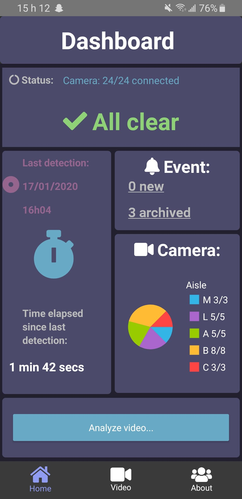
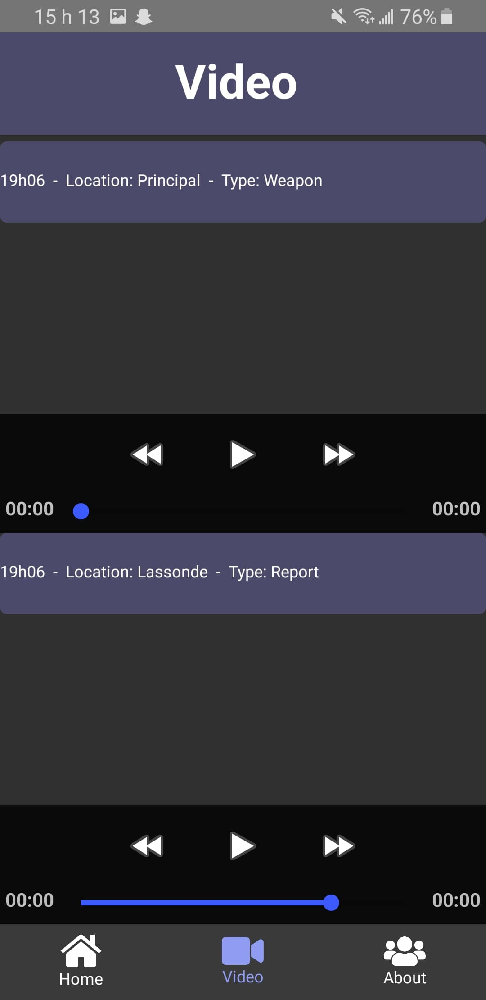

# Gun-Detection-APP

This is the project created at hackathon 2020. A real-time Gun and Knife detection application using [Google's TensorFlow Object Detection API](https://github.com/tensorflow/models/tree/master/research/object_detection) and [OpenCV](http://opencv.org/).

## Getting Started
1. `conda env create -f environment.yml`
2. `python object_detection_app.py` / `python object_detection_multithreading.py`
    Optional arguments (default value):
    * Device index of the camera `--source=0`
    * Width of the frames in the video stream `--width=480`
    * Height of the frames in the video stream `--height=360`
    * Number of workers `--num-workers=2`
    * Size of the queue `--queue-size=5`
    * Get video from HLS stream rather than webcam '--stream-input=http://somertmpserver.com/hls/live.m3u8'
    * Send stream to livestreaming server '--stream-output=--stream=http://somertmpserver.com/hls/live.m3u8'

## Tests
```
pytest -vs utils/
```

## Requirements
- [Anaconda / Python 3.5](https://www.continuum.io/downloads)
- [TensorFlow 1.2](https://www.tensorflow.org/)
- [OpenCV 3.0](http://opencv.org/)